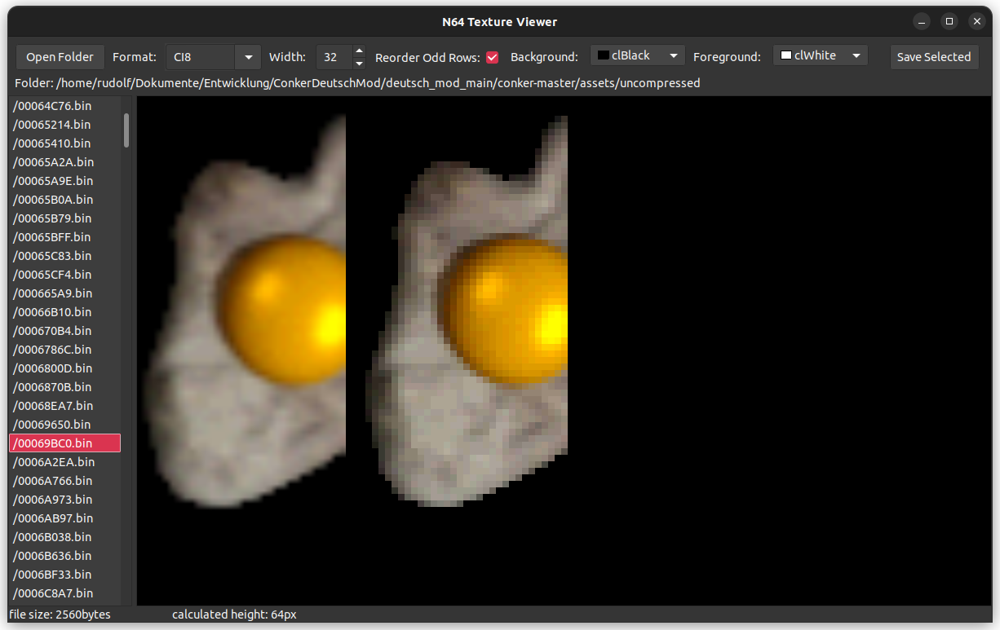
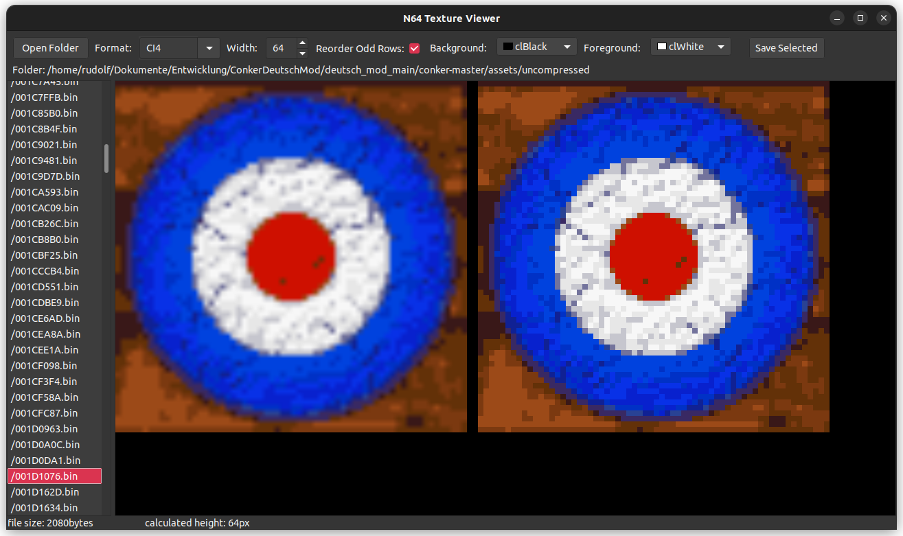
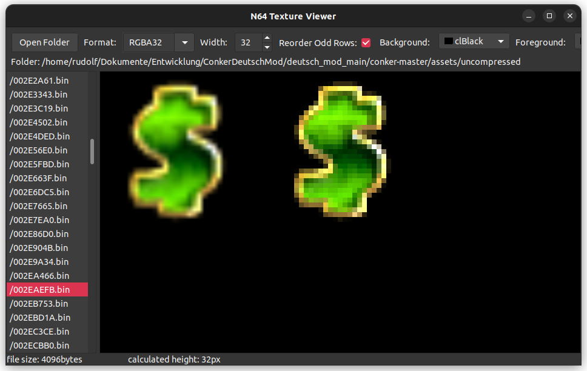
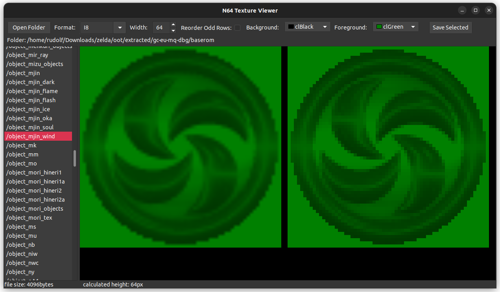
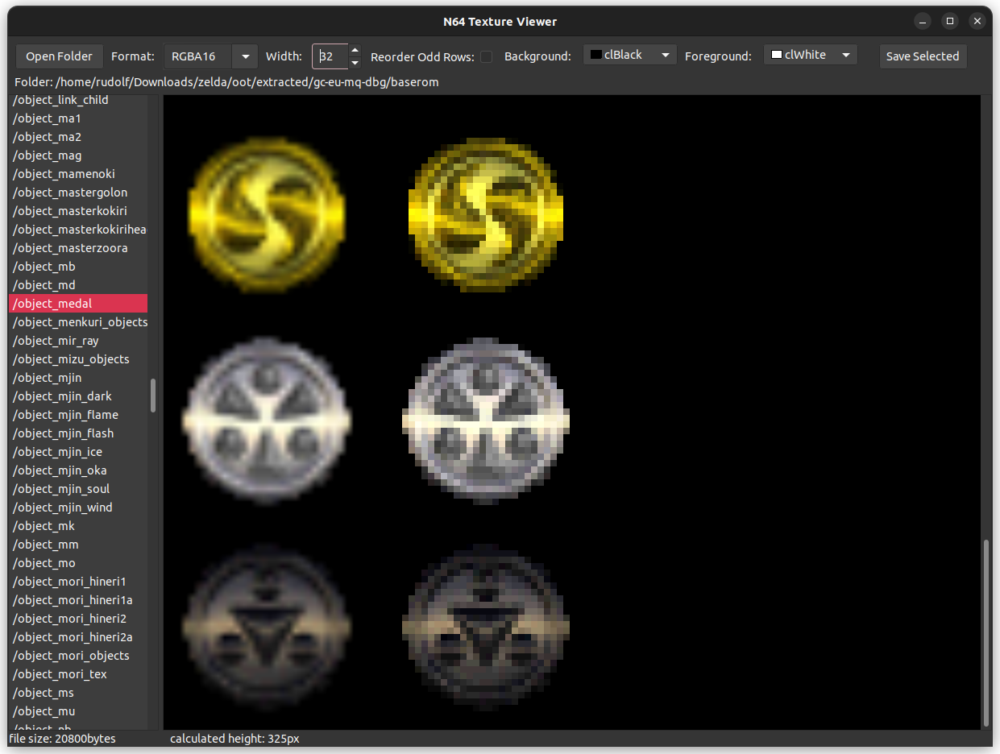
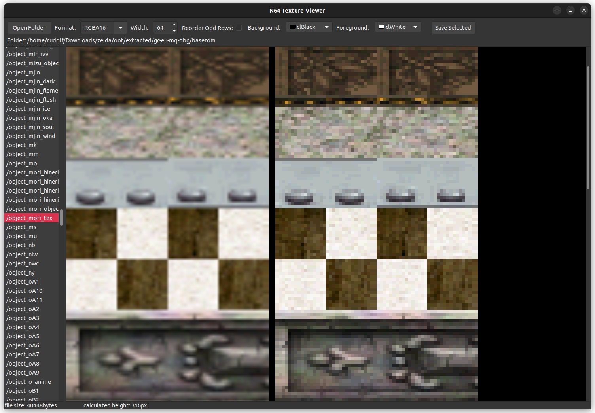

# RN64TexTools
Tools for viewing and converting N64 textures

<div style="display: flex;">
    
    
    
</div>
<div style="display: flex;">
    
    
    
</div>

## Building

Build process of RN64TexTools requires only the Lazarus IDE which can be installed under Debian-based systems with:

```sh
sudo apt install lazarus
```

Then clone this project:

```sh
git clone https://github.com/niehoff90/RN64TexTools.git
cd RN64TexTools
```

Finally build with:
```sh
lazbuild RN64TexView.lpi
lazbuild RN64TexConv.lpi
````